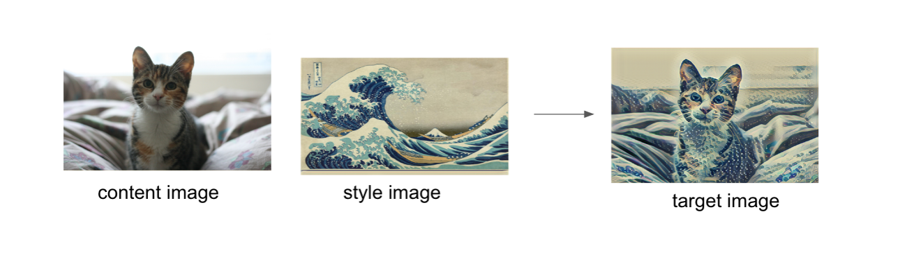

# Deep Learning Style Transfer

This is a small project I created while participating in the Udacity Deep Learning Nanodegree 
The goal of the project was to use a pre-trained convolutional neural network to transfer style from one image to another based on the "[Image Style Transfer Using Convolutional Neural Networks](https://www.cv-foundation.org/openaccess/content_cvpr_2016/papers/Gatys_Image_Style_Transfer_CVPR_2016_paper.pdf)" article. 
In order to do so I used the VGG19 pre-trained model, with alpha of 1 and beta of 1e6 
Code is written in python with PyTorch library on a Jupyter Notebook platform.

## Table of Contents

* [Load the Notebook](#load-the-notebook)
* [Dependencies](#dependencies)
* [Contributing](#contributing)

## Load the Notebook

* [Clone via Github](https://github.com/EliShayGH/deep-learning-style-transfer.git)
* [Download a zip file](https://github.com/EliShayGH/deep-learning-style-transfer/archive/master.zip)
* [Google Colab](https://colab.research.google.com/github/EliShayGH/deep-learning-style-transfer/blob/master/Style_Transfer_Exercise.ipynb)

## Dependencies:

* [Anaconda Python 3](https://www.anaconda.com/)
* Python libraries: PyTorch, numpy, pandas, matplotlib
* [Jupyter Notebook](https://jupyter.org/)

## Contributing

If you are willing to contribute to this project
you are more than welcome to send a pull request

For details, check out [CONTRIBUTING.md](CONTRIBUTING.md).
